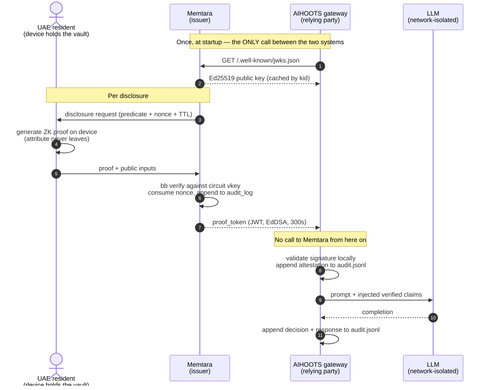
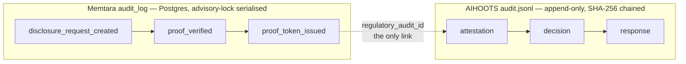

# Memtara × AIHOOTS — CBUAE Demonstration of Compliance

*Generated 2026-09-16T09:00:00+00:00 by `scripts/generate_regulatory_demo.py`. Deterministic: re-running produces an identical document.*

This report walks five real UAE disclosure journeys from the consumer's consent through to a tamper-evident audit record, and shows the exact artefact produced at each step. Section E adds a sixth under a different regulator — DFSA Conduct of Business 3.1 — because structured-product suitability is the case where the honest answer is sometimes no, and where a system that can only evidence approvals fails the rule it claims to satisfy. It is the worked companion to [`REGULATORY_MATRIX.md`](REGULATORY_MATRIX.md), which does the clause-by-clause mapping.

## What is real here, and what is not

A compliance demonstration that quietly mixes real and illustrative material is worse than none, so the line is drawn explicitly.

| Element | Status |
|---|---|
| Ed25519 keypair, JWK Set, and every JWT below | **Real.** The tokens verify against the JWK Set printed in Section B. Paste both into any JOSE library. |
| The SHA-256 audit chain in Section C | **Real.** Computed by AIHOOTS's own `AuditChain` (`tests/aihoots_reference/src/gateway/audit/chain.py`), then verified by its own `audit-verify`. |
| Policy decisions on each prompt | **Real.** AIHOOTS's own `evaluate()` ran on the actual injected prompt text. |
| The 100 resident profiles | **Synthetic** (`faker`, seed `20260916`). Deliberately: putting real residents in a circulated compliance document would breach the clause this document is about (§5(c)). |
| The zero-knowledge proofs in Sections A–D | **Stand-ins.** Their bytes are hashed into `proof_hash` exactly as real proof bytes would be, so the *binding* shown is genuine, but they are not proofs. |
| The zero-knowledge proof machinery itself | **Real, and exercised — just not from this script.** `tests/test_wealth_suitability_e2e.py` generates genuine Barretenberg proofs of the `wealth_suitability` circuit on a real Baby Jubjub signature and has the real server accept them via `bb verify`. It is not done here because `bb`'s proofs are randomised for zero-knowledge, so a report containing one could not regenerate byte-identically — and a compliance artefact that cannot be diffed is worse than one that cites its proofs by hash. |
| The signing key | **A published demo key**, not a deployment key. Nothing here is valid against a real Memtara deployment — the correct property for a document meant to be shared. |

Self-checks this script ran before writing the file:

- 17/5 tokens validated offline against the published JWK Set
- JWKS network fetches performed during validation: **0**
- `audit-verify` on the generated chain: **intact**
- Tamper test (detail.proof_hash (ac8ccbadf42d15b0… -> 000…)): **detected** — `record seq=0: record_hash does not match contents (record was altered)`

---

## Section A — Five journeys

Drawn from [`journeys.md`](journeys.md) and instantiated against the 100-profile synthetic population described in Section E.

| # | Journey | Relying party | Predicate proven | Circuit | Stays private |
|---|---|---|---|---|---|
| 1 | Mortgage pre-approval | Emirates Union Bank — Retail Lending | `income_gte_threshold` | `tax_session` | exact salary; employer name; passport copy; 90 days of bank statements |
| 2 | Golden Visa / investor onboarding | DIFC Wealth Partners | `investor_category_verified` | `identity_session` | net worth; portfolio composition; the visa application file |
| 3 | AML / STR compliance clearance | Emirates Union Bank — Financial Crime | `compliance_clear` | `identity_session` | source-of-funds documents; 90-day transaction history; counterparty identities |
| 4 | Real-estate proof-of-funds | Marina Escrow Services | `funds_gte_price` | `tax_session` | account balance; which banks hold the funds; asset mix |
| 5 | Assisted emergency card | Al Jalila Emergency Department | `emergency_medical_disclosure` | `emergency_session` | full medical history; insurance details; next-of-kin contact records |

### A1. Mortgage pre-approval

**Trigger.** A developer requests residency plus income-tier verification before issuing a pre-approval decision.

**Consumer** (synthetic): Employment residency (2-year), Fujairah, income tier T3, residency valid to 2034-03-04.

**Disclosed.** `income_gte_threshold = true`. Nothing else crosses. Specifically withheld: exact salary, employer name, passport copy, 90 days of bank statements.

### A2. Golden Visa / investor onboarding

**Trigger.** A wealth manager's onboarding flow needs investor-category and compliance-clean confirmation before a relationship-manager call.

**Consumer** (synthetic): Employment residency (2-year), Umm Al Quwain, income tier T1, residency valid to 2030-05-10.

**Disclosed.** `investor_category_verified = true`. Nothing else crosses. Specifically withheld: net worth, portfolio composition, the visa application file.

### A3. AML / STR compliance clearance

**Trigger.** A transaction-monitoring flag needs an STR narrative resolved during a routine KYC refresh.

**Consumer** (synthetic): Green Visa (5-year), Fujairah, income tier T5, residency valid to 2029-03-09.

**Disclosed.** `compliance_clear = true`. Nothing else crosses. Specifically withheld: source-of-funds documents, 90-day transaction history, counterparty identities.

### A4. Real-estate proof-of-funds

**Trigger.** Reserving a unit above the escrow threshold requires proof of funds before the unit is held.

**Consumer** (synthetic): Golden Visa (10-year), Umm Al Quwain, income tier T3, residency valid to 2028-09-05.

**Disclosed.** `funds_gte_price = true`. Nothing else crosses. Specifically withheld: account balance, which banks hold the funds, asset mix.

### A5. Assisted emergency card

**Trigger.** A paramedic scans an NFC card carried by a resident who is unable to unlock a phone.

**Consumer** (synthetic): Golden Visa (10-year), Umm Al Quwain, income tier T4, residency valid to 2033-02-25.

**Disclosed.** `emergency_medical_disclosure = true`. Nothing else crosses. Specifically withheld: full medical history, insurance details, next-of-kin contact records.

---

## Section B — The exact calls, tokens and records

### B0. The published key

Every relying party below fetches this once and caches it. After that, validation is one local Ed25519 check — no call reaches Memtara. That is the whole basis of the zero-latency claim, and it is asserted as a test (`test_validation_makes_no_call_to_memtara`), not just as prose.

```http
GET https://api.memtara.ai/.well-known/jwks.json
```

```json
{
  "keys": [
    {
      "kty": "OKP",
      "crv": "Ed25519",
      "x": "C7w0aldmfDgBIL2cf9flHSxf3-o3zS9b9AWyxr9vLXg",
      "use": "sig",
      "alg": "EdDSA",
      "kid": "_aGLP6XUoPZHhE76d5kH7ePrMxKrtMZuLejRbmEUbTk"
    }
  ]
}
```

### B1. Mortgage pre-approval

**1 — The relying party requests a disclosure.**

```http
POST https://api.memtara.ai/disclosure-requests
Authorization: Bearer <org api key>
Content-Type: application/json

{
  "user_id": "61ea5cd6-aeb9-4f44-8aff-37b0a9993823",
  "circuit_type": "tax_session",
  "policy": {
    "session_type": "TaxSession"
  },
  "ttl_seconds": 900
}
```

The consumer sees the predicate and approves it on their own device. Declining is simply not acting — no proof is generated, and there is no data flow to withdraw from (CBUAE §4(c), opt-out).

**2 — Memtara issues the attestation.**

```http
POST https://api.memtara.ai/api/v1/issue-proof
Authorization: Bearer <org api key>
Content-Type: application/json

{
  "user_id": "61ea5cd6-aeb9-4f44-8aff-37b0a9993823",
  "predicate": "income_gte_threshold"
}
```

```json
{
  "proof_token": "eyJhbGciOiJFZERTQSIsInR5cCI6IkpXVCIsImtpZCI6Il9h\u2026",
  "expires_in": 300,
  "regulatory_audit_id": "4f786106-e2c0-4d56-80c3-a442fa3fcd12"
}
```

**3 — The issued token, in full.** Verifies against B0.

```
eyJhbGciOiJFZERTQSIsInR5cCI6IkpXVCIsImtpZCI6Il9hR0xQNlhVb1BaSGhFNzZkNWtIN2VQ
ck14S3J0TVp1TGVqUmJtRVViVGsifQ.eyJpc3MiOiJodHRwczovL2FwaS5tZW10YXJhLmFpIiwic
3ViIjoiNjFlYTVjZDYtYWViOS00ZjQ0LThhZmYtMzdiMGE5OTkzODIzIiwidXNlcl9pZCI6IjYxZ
WE1Y2Q2LWFlYjktNGY0NC04YWZmLTM3YjBhOTk5MzgyMyIsInByZWRpY2F0ZSI6ImluY29tZV9nd
GVfdGhyZXNob2xkIiwidmVyaWZpZWQiOnRydWUsImNpcmN1aXQiOiJ0YXhfc2Vzc2lvbiIsInByb
29mX2hhc2giOiJhYzhjY2JhZGY0MmQxNWIwY2JkOTI3OTYzOGY0NDU4YzYxZWY5NDNjMTBhZTg2M
zc0NTRmNTU1ZDhkMWVkNDc0IiwicmVndWxhdG9yeV9hdWRpdF9pZCI6IjRmNzg2MTA2LWUyYzAtN
GQ1Ni04MGMzLWE0NDJmYTNmY2QxMiIsImNidWFlX2NsYXVzZXMiOlsiNShjKSIsIjUoZCkiLCI0K
GEpIl0sImlhdCI6MTc4OTU0OTIwMCwiZXhwIjoxNzg5NTQ5NTAwLCJqdGkiOiIwMTJkNjBmZS0zY
zgyLTRmY2EtOGU0ZS00MDYyNDI5ZTlkZmQifQ.0VOb4wBbLgEJF8hmyxydzi6RlDQME7idJYDU3o
xDB6KZo9js0jHn4pTnbjq4w7PmyCSfXdg2uJ_qwrfBsilVDw
```

Decoded payload:

```json
{
  "iss": "https://api.memtara.ai",
  "sub": "61ea5cd6-aeb9-4f44-8aff-37b0a9993823",
  "user_id": "61ea5cd6-aeb9-4f44-8aff-37b0a9993823",
  "predicate": "income_gte_threshold",
  "verified": true,
  "circuit": "tax_session",
  "proof_hash": "ac8ccbadf42d15b0cbd9279638f4458c61ef943c10ae8637454f555d8d1ed474",
  "regulatory_audit_id": "4f786106-e2c0-4d56-80c3-a442fa3fcd12",
  "cbuae_clauses": [
    "5(c)",
    "5(d)",
    "4(a)"
  ],
  "iat": 1789549200,
  "exp": 1789549500,
  "jti": "012d60fe-3c82-4fca-8e4e-4062429e9dfd"
}
```

**4 — AIHOOTS validates offline and injects the verified facts.**

```http
POST https://ai.aihoots.com/v1/chat/completions
X-Memtara-Proof: eyJhbGciOiJFZERTQSIsInR5cCI6IkpXVCIsImtp…
X-Caller-Id: Emirates Union Bank — Retail Lending
```

The system message the model actually receives:

```text
[VERIFIED ATTRIBUTES — cryptographically attested by Memtara, issuer https://api.memtara.ai]
- subject: 61ea5cd6-aeb9-4f44-8aff-37b0a9993823
- verified predicate: income_gte_threshold = true
- evidence: zero-knowledge proof, circuit tax_session, proof_hash ac8ccbadf42d15b0cbd9279638f4458c61ef943c10ae8637454f555d8d1ed474
- regulatory_audit_id: 4f786106-e2c0-4d56-80c3-a442fa3fcd12 (CBUAE clauses: 5(c), 5(d), 4(a))
- NOT disclosed: the underlying attribute value. Only the predicate above was proven. Do not infer, estimate or ask for the underlying value.
```

followed by the operator's own turn: *“Does this applicant meet our pre-approval floor for a 15-year facility?”*

**5 — AIHOOTS logs it.** Policy decision: `allow`. Three records land in the hash chain — the attestation, the policy decision, and the response:

```jsonl
{"seq":0,"event_type":"attestation","decision":"allow","caller":"Emirates Union Bank \u2014 Retail Lending","model":"qwen2.5:3b-instruct","detail":{"memtara_verified":true,"memtara_user_id":"61ea5cd6-aeb9-4f44-8aff-37b0a9993823","memtara_predicate":"income_gte_threshold","memtara_circuit":"tax_session","proof_hash":"ac8ccbadf42d15b0cbd9279638f4458c61ef943c10ae8637454f555d8d1ed474","regulatory_audit_id":"4f786106-e2c0-4d56-80c3-a442fa3fcd12","cbuae_clauses":["5(c)","5(d)","4(a)"],"memtara_issuer":"https://api.memtara.ai"},"prev_hash":"0000000000000000\u2026","record_hash":"755fbf343a3ca4fd\u2026"}
{"seq":1,"event_type":"decision","decision":"allow","caller":"Emirates Union Bank \u2014 Retail Lending","model":"qwen2.5:3b-instruct","prompt_digest":"faa98ab48ce228f2\u2026","detail":{"reasons":["no policy triggers"]},"prev_hash":"755fbf343a3ca4fd\u2026","record_hash":"9ee903f9179ea578\u2026"}
{"seq":2,"event_type":"response","decision":"n/a","caller":"Emirates Union Bank \u2014 Retail Lending","model":"qwen2.5:3b-instruct","response_digest":"efd0be280d72b0d5\u2026","prev_hash":"9ee903f9179ea578\u2026","record_hash":"586d10b152c07084\u2026"}
```

### B2. Golden Visa / investor onboarding

**1 — The relying party requests a disclosure.**

```http
POST https://api.memtara.ai/disclosure-requests
Authorization: Bearer <org api key>
Content-Type: application/json

{
  "user_id": "9b9de663-e733-4909-a839-4383426f97bc",
  "circuit_type": "identity_session",
  "policy": {
    "session_type": "IdentitySession"
  },
  "ttl_seconds": 900
}
```

The consumer sees the predicate and approves it on their own device. Declining is simply not acting — no proof is generated, and there is no data flow to withdraw from (CBUAE §4(c), opt-out).

**2 — Memtara issues the attestation.**

```http
POST https://api.memtara.ai/api/v1/issue-proof
Authorization: Bearer <org api key>
Content-Type: application/json

{
  "user_id": "9b9de663-e733-4909-a839-4383426f97bc",
  "predicate": "investor_category_verified"
}
```

```json
{
  "proof_token": "eyJhbGciOiJFZERTQSIsInR5cCI6IkpXVCIsImtpZCI6Il9h\u2026",
  "expires_in": 300,
  "regulatory_audit_id": "a652f4bb-3576-46c6-852a-bca7ef1764b3"
}
```

**3 — The issued token, in full.** Verifies against B0.

```
eyJhbGciOiJFZERTQSIsInR5cCI6IkpXVCIsImtpZCI6Il9hR0xQNlhVb1BaSGhFNzZkNWtIN2VQ
ck14S3J0TVp1TGVqUmJtRVViVGsifQ.eyJpc3MiOiJodHRwczovL2FwaS5tZW10YXJhLmFpIiwic
3ViIjoiOWI5ZGU2NjMtZTczMy00OTA5LWE4MzktNDM4MzQyNmY5N2JjIiwidXNlcl9pZCI6IjliO
WRlNjYzLWU3MzMtNDkwOS1hODM5LTQzODM0MjZmOTdiYyIsInByZWRpY2F0ZSI6ImludmVzdG9yX
2NhdGVnb3J5X3ZlcmlmaWVkIiwidmVyaWZpZWQiOnRydWUsImNpcmN1aXQiOiJpZGVudGl0eV9zZ
XNzaW9uIiwicHJvb2ZfaGFzaCI6ImYxMTUwMGY4YWQ3MmRiYzk0NjQxNWEzOTVmZjljYzI1ZWQ4Z
Dk0NjkxMzY2MTc3YjhlOThhN2U1ZTBhZTUzOGIiLCJyZWd1bGF0b3J5X2F1ZGl0X2lkIjoiYTY1M
mY0YmItMzU3Ni00NmM2LTg1MmEtYmNhN2VmMTc2NGIzIiwiY2J1YWVfY2xhdXNlcyI6WyI1KGMpI
iwiNShhKSJdLCJpYXQiOjE3ODk1NDkyMDEsImV4cCI6MTc4OTU0OTUwMSwianRpIjoiN2IyOWE0M
2UtZDllMS00MzFlLThmNDgtYmJhMDM2YmViYzQ0In0.1GaHOQ-jDPJbCSiIlCFpEH7_CwGaicf86
eQqU68KS1OR4tFHQveSJOW2zahoIqO8euspb5D1VvfGNadqp8IRBA
```

Decoded payload:

```json
{
  "iss": "https://api.memtara.ai",
  "sub": "9b9de663-e733-4909-a839-4383426f97bc",
  "user_id": "9b9de663-e733-4909-a839-4383426f97bc",
  "predicate": "investor_category_verified",
  "verified": true,
  "circuit": "identity_session",
  "proof_hash": "f11500f8ad72dbc946415a395ff9cc25ed8d94691366177b8e98a7e5e0ae538b",
  "regulatory_audit_id": "a652f4bb-3576-46c6-852a-bca7ef1764b3",
  "cbuae_clauses": [
    "5(c)",
    "5(a)"
  ],
  "iat": 1789549201,
  "exp": 1789549501,
  "jti": "7b29a43e-d9e1-431e-8f48-bba036bebc44"
}
```

**4 — AIHOOTS validates offline and injects the verified facts.**

```http
POST https://ai.aihoots.com/v1/chat/completions
X-Memtara-Proof: eyJhbGciOiJFZERTQSIsInR5cCI6IkpXVCIsImtp…
X-Caller-Id: DIFC Wealth Partners
```

The system message the model actually receives:

```text
[VERIFIED ATTRIBUTES — cryptographically attested by Memtara, issuer https://api.memtara.ai]
- subject: 9b9de663-e733-4909-a839-4383426f97bc
- verified predicate: investor_category_verified = true
- evidence: zero-knowledge proof, circuit identity_session, proof_hash f11500f8ad72dbc946415a395ff9cc25ed8d94691366177b8e98a7e5e0ae538b
- regulatory_audit_id: a652f4bb-3576-46c6-852a-bca7ef1764b3 (CBUAE clauses: 5(c), 5(a))
- NOT disclosed: the underlying attribute value. Only the predicate above was proven. Do not infer, estimate or ask for the underlying value.
```

followed by the operator's own turn: *“Is this prospect eligible for the DIFC private-client tier?”*

**5 — AIHOOTS logs it.** Policy decision: `allow`. Three records land in the hash chain — the attestation, the policy decision, and the response:

```jsonl
{"seq":3,"event_type":"attestation","decision":"allow","caller":"DIFC Wealth Partners","model":"qwen2.5:3b-instruct","detail":{"memtara_verified":true,"memtara_user_id":"9b9de663-e733-4909-a839-4383426f97bc","memtara_predicate":"investor_category_verified","memtara_circuit":"identity_session","proof_hash":"f11500f8ad72dbc946415a395ff9cc25ed8d94691366177b8e98a7e5e0ae538b","regulatory_audit_id":"a652f4bb-3576-46c6-852a-bca7ef1764b3","cbuae_clauses":["5(c)","5(a)"],"memtara_issuer":"https://api.memtara.ai"},"prev_hash":"586d10b152c07084\u2026","record_hash":"9163e167dcc91c69\u2026"}
{"seq":4,"event_type":"decision","decision":"allow","caller":"DIFC Wealth Partners","model":"qwen2.5:3b-instruct","prompt_digest":"7acca8463f4795fe\u2026","detail":{"reasons":["no policy triggers"]},"prev_hash":"9163e167dcc91c69\u2026","record_hash":"7ea636e5099febe9\u2026"}
{"seq":5,"event_type":"response","decision":"n/a","caller":"DIFC Wealth Partners","model":"qwen2.5:3b-instruct","response_digest":"91d2c158ab13eb5a\u2026","prev_hash":"7ea636e5099febe9\u2026","record_hash":"05fc5dd73295a2dd\u2026"}
```

### B3. AML / STR compliance clearance

**1 — The relying party requests a disclosure.**

```http
POST https://api.memtara.ai/disclosure-requests
Authorization: Bearer <org api key>
Content-Type: application/json

{
  "user_id": "8c136e97-1d5d-4a28-867e-ffa39ffebdc7",
  "circuit_type": "identity_session",
  "policy": {
    "session_type": "IdentitySession"
  },
  "ttl_seconds": 900
}
```

The consumer sees the predicate and approves it on their own device. Declining is simply not acting — no proof is generated, and there is no data flow to withdraw from (CBUAE §4(c), opt-out).

**2 — Memtara issues the attestation.**

```http
POST https://api.memtara.ai/api/v1/issue-proof
Authorization: Bearer <org api key>
Content-Type: application/json

{
  "user_id": "8c136e97-1d5d-4a28-867e-ffa39ffebdc7",
  "predicate": "compliance_clear"
}
```

```json
{
  "proof_token": "eyJhbGciOiJFZERTQSIsInR5cCI6IkpXVCIsImtpZCI6Il9h\u2026",
  "expires_in": 300,
  "regulatory_audit_id": "93c163aa-d44a-4aac-a6a0-0c420ab9feac"
}
```

**3 — The issued token, in full.** Verifies against B0.

```
eyJhbGciOiJFZERTQSIsInR5cCI6IkpXVCIsImtpZCI6Il9hR0xQNlhVb1BaSGhFNzZkNWtIN2VQ
ck14S3J0TVp1TGVqUmJtRVViVGsifQ.eyJpc3MiOiJodHRwczovL2FwaS5tZW10YXJhLmFpIiwic
3ViIjoiOGMxMzZlOTctMWQ1ZC00YTI4LTg2N2UtZmZhMzlmZmViZGM3IiwidXNlcl9pZCI6IjhjM
TM2ZTk3LTFkNWQtNGEyOC04NjdlLWZmYTM5ZmZlYmRjNyIsInByZWRpY2F0ZSI6ImNvbXBsaWFuY
2VfY2xlYXIiLCJ2ZXJpZmllZCI6dHJ1ZSwiY2lyY3VpdCI6ImlkZW50aXR5X3Nlc3Npb24iLCJwc
m9vZl9oYXNoIjoiZWFmZjhjNmM2ZjYxODUwYzAwNGFmZDI3MTI4MTg3YzAyYmVjOTgyZTNmOTJhM
TcwMDQ1MjVlMGExODY1MTI1MyIsInJlZ3VsYXRvcnlfYXVkaXRfaWQiOiI5M2MxNjNhYS1kNDRhL
TRhYWMtYTZhMC0wYzQyMGFiOWZlYWMiLCJjYnVhZV9jbGF1c2VzIjpbIjUoZSkiLCIzKGEpIl0sI
mlhdCI6MTc4OTU0OTIwMiwiZXhwIjoxNzg5NTQ5NTAyLCJqdGkiOiI0YTg3MWMzYy0xZjk3LTRhM
DMtYjJiZS0zY2E3YzViNTQ3MGYifQ.0wbaMEF5qLUVEm7PFcfjrVGSZvetZZFXfNI-AFrR5-82k-
aF_QKMhvHvOSpqudo7Znb7tz-V-OUk5ECn6o-wAw
```

Decoded payload:

```json
{
  "iss": "https://api.memtara.ai",
  "sub": "8c136e97-1d5d-4a28-867e-ffa39ffebdc7",
  "user_id": "8c136e97-1d5d-4a28-867e-ffa39ffebdc7",
  "predicate": "compliance_clear",
  "verified": true,
  "circuit": "identity_session",
  "proof_hash": "eaff8c6c6f61850c004afd27128187c02bec982e3f92a17004525e0a18651253",
  "regulatory_audit_id": "93c163aa-d44a-4aac-a6a0-0c420ab9feac",
  "cbuae_clauses": [
    "5(e)",
    "3(a)"
  ],
  "iat": 1789549202,
  "exp": 1789549502,
  "jti": "4a871c3c-1f97-4a03-b2be-3ca7c5b5470f"
}
```

**4 — AIHOOTS validates offline and injects the verified facts.**

```http
POST https://ai.aihoots.com/v1/chat/completions
X-Memtara-Proof: eyJhbGciOiJFZERTQSIsInR5cCI6IkpXVCIsImtp…
X-Caller-Id: Emirates Union Bank — Financial Crime
```

The system message the model actually receives:

```text
[VERIFIED ATTRIBUTES — cryptographically attested by Memtara, issuer https://api.memtara.ai]
- subject: 8c136e97-1d5d-4a28-867e-ffa39ffebdc7
- verified predicate: compliance_clear = true
- evidence: zero-knowledge proof, circuit identity_session, proof_hash eaff8c6c6f61850c004afd27128187c02bec982e3f92a17004525e0a18651253
- regulatory_audit_id: 93c163aa-d44a-4aac-a6a0-0c420ab9feac (CBUAE clauses: 5(e), 3(a))
- NOT disclosed: the underlying attribute value. Only the predicate above was proven. Do not infer, estimate or ask for the underlying value.
```

followed by the operator's own turn: *“Summarise the residual risk factors for this STR narrative.”*

**5 — AIHOOTS logs it.** Policy decision: `allow`. Three records land in the hash chain — the attestation, the policy decision, and the response:

```jsonl
{"seq":6,"event_type":"attestation","decision":"allow","caller":"Emirates Union Bank \u2014 Financial Crime","model":"qwen2.5:3b-instruct","detail":{"memtara_verified":true,"memtara_user_id":"8c136e97-1d5d-4a28-867e-ffa39ffebdc7","memtara_predicate":"compliance_clear","memtara_circuit":"identity_session","proof_hash":"eaff8c6c6f61850c004afd27128187c02bec982e3f92a17004525e0a18651253","regulatory_audit_id":"93c163aa-d44a-4aac-a6a0-0c420ab9feac","cbuae_clauses":["5(e)","3(a)"],"memtara_issuer":"https://api.memtara.ai"},"prev_hash":"05fc5dd73295a2dd\u2026","record_hash":"a3a51032b431a192\u2026"}
{"seq":7,"event_type":"decision","decision":"allow","caller":"Emirates Union Bank \u2014 Financial Crime","model":"qwen2.5:3b-instruct","prompt_digest":"f1d298d8033fac50\u2026","detail":{"reasons":["no policy triggers"]},"prev_hash":"a3a51032b431a192\u2026","record_hash":"2bb647cdb27fadec\u2026"}
{"seq":8,"event_type":"response","decision":"n/a","caller":"Emirates Union Bank \u2014 Financial Crime","model":"qwen2.5:3b-instruct","response_digest":"3c508590de9c1213\u2026","prev_hash":"2bb647cdb27fadec\u2026","record_hash":"00ffe2efb48eaec7\u2026"}
```

### B4. Real-estate proof-of-funds

**1 — The relying party requests a disclosure.**

```http
POST https://api.memtara.ai/disclosure-requests
Authorization: Bearer <org api key>
Content-Type: application/json

{
  "user_id": "18de3479-3aeb-40a1-9210-45c5b0bce022",
  "circuit_type": "tax_session",
  "policy": {
    "session_type": "TaxSession"
  },
  "ttl_seconds": 900
}
```

The consumer sees the predicate and approves it on their own device. Declining is simply not acting — no proof is generated, and there is no data flow to withdraw from (CBUAE §4(c), opt-out).

**2 — Memtara issues the attestation.**

```http
POST https://api.memtara.ai/api/v1/issue-proof
Authorization: Bearer <org api key>
Content-Type: application/json

{
  "user_id": "18de3479-3aeb-40a1-9210-45c5b0bce022",
  "predicate": "funds_gte_price"
}
```

```json
{
  "proof_token": "eyJhbGciOiJFZERTQSIsInR5cCI6IkpXVCIsImtpZCI6Il9h\u2026",
  "expires_in": 300,
  "regulatory_audit_id": "87098a5d-9fa8-44f9-b7aa-f673fb46bcf4"
}
```

**3 — The issued token, in full.** Verifies against B0.

```
eyJhbGciOiJFZERTQSIsInR5cCI6IkpXVCIsImtpZCI6Il9hR0xQNlhVb1BaSGhFNzZkNWtIN2VQ
ck14S3J0TVp1TGVqUmJtRVViVGsifQ.eyJpc3MiOiJodHRwczovL2FwaS5tZW10YXJhLmFpIiwic
3ViIjoiMThkZTM0NzktM2FlYi00MGExLTkyMTAtNDVjNWIwYmNlMDIyIiwidXNlcl9pZCI6IjE4Z
GUzNDc5LTNhZWItNDBhMS05MjEwLTQ1YzViMGJjZTAyMiIsInByZWRpY2F0ZSI6ImZ1bmRzX2d0Z
V9wcmljZSIsInZlcmlmaWVkIjp0cnVlLCJjaXJjdWl0IjoidGF4X3Nlc3Npb24iLCJwcm9vZl9oY
XNoIjoiYzJhZDA5OGFjYWM5ZTVhNjU3ODQyNWQxMjA5NWJjZjg3Mjk1N2ZjNzhlZTIzYjg3MDlkY
jA4MjNhY2RmNWM1NyIsInJlZ3VsYXRvcnlfYXVkaXRfaWQiOiI4NzA5OGE1ZC05ZmE4LTQ0ZjktY
jdhYS1mNjczZmI0NmJjZjQiLCJjYnVhZV9jbGF1c2VzIjpbIjUoYykiLCI1KGQpIl0sImlhdCI6M
Tc4OTU0OTIwMywiZXhwIjoxNzg5NTQ5NTAzLCJqdGkiOiJjMzY2YjllNi1jZDgzLTRkYzYtOGE4O
C1lYTUzMjk5MzUxMjAifQ.jXvm3v-MjgYHqaZnh0OaITP6cyLHC0is-MHyTAy9sCIKBnmJxEf4sz
u7piYDD0UQLQ6NTWyISXuyDbiXzyMHBA
```

Decoded payload:

```json
{
  "iss": "https://api.memtara.ai",
  "sub": "18de3479-3aeb-40a1-9210-45c5b0bce022",
  "user_id": "18de3479-3aeb-40a1-9210-45c5b0bce022",
  "predicate": "funds_gte_price",
  "verified": true,
  "circuit": "tax_session",
  "proof_hash": "c2ad098acac9e5a6578425d12095bcf872957fc78ee23b8709db0823acdf5c57",
  "regulatory_audit_id": "87098a5d-9fa8-44f9-b7aa-f673fb46bcf4",
  "cbuae_clauses": [
    "5(c)",
    "5(d)"
  ],
  "iat": 1789549203,
  "exp": 1789549503,
  "jti": "c366b9e6-cd83-4dc6-8a88-ea5329935120"
}
```

**4 — AIHOOTS validates offline and injects the verified facts.**

```http
POST https://ai.aihoots.com/v1/chat/completions
X-Memtara-Proof: eyJhbGciOiJFZERTQSIsInR5cCI6IkpXVCIsImtp…
X-Caller-Id: Marina Escrow Services
```

The system message the model actually receives:

```text
[VERIFIED ATTRIBUTES — cryptographically attested by Memtara, issuer https://api.memtara.ai]
- subject: 18de3479-3aeb-40a1-9210-45c5b0bce022
- verified predicate: funds_gte_price = true
- evidence: zero-knowledge proof, circuit tax_session, proof_hash c2ad098acac9e5a6578425d12095bcf872957fc78ee23b8709db0823acdf5c57
- regulatory_audit_id: 87098a5d-9fa8-44f9-b7aa-f673fb46bcf4 (CBUAE clauses: 5(c), 5(d))
- NOT disclosed: the underlying attribute value. Only the predicate above was proven. Do not infer, estimate or ask for the underlying value.
```

followed by the operator's own turn: *“Can we release the reservation hold on unit 2104?”*

**5 — AIHOOTS logs it.** Policy decision: `allow`. Three records land in the hash chain — the attestation, the policy decision, and the response:

```jsonl
{"seq":9,"event_type":"attestation","decision":"allow","caller":"Marina Escrow Services","model":"qwen2.5:3b-instruct","detail":{"memtara_verified":true,"memtara_user_id":"18de3479-3aeb-40a1-9210-45c5b0bce022","memtara_predicate":"funds_gte_price","memtara_circuit":"tax_session","proof_hash":"c2ad098acac9e5a6578425d12095bcf872957fc78ee23b8709db0823acdf5c57","regulatory_audit_id":"87098a5d-9fa8-44f9-b7aa-f673fb46bcf4","cbuae_clauses":["5(c)","5(d)"],"memtara_issuer":"https://api.memtara.ai"},"prev_hash":"00ffe2efb48eaec7\u2026","record_hash":"8a3a6bb8fd0a20c8\u2026"}
{"seq":10,"event_type":"decision","decision":"allow","caller":"Marina Escrow Services","model":"qwen2.5:3b-instruct","prompt_digest":"c7d9a452a13dfe58\u2026","detail":{"reasons":["no policy triggers"]},"prev_hash":"8a3a6bb8fd0a20c8\u2026","record_hash":"641c93cd3f65a126\u2026"}
{"seq":11,"event_type":"response","decision":"n/a","caller":"Marina Escrow Services","model":"qwen2.5:3b-instruct","response_digest":"d087574c4c0720bd\u2026","prev_hash":"641c93cd3f65a126\u2026","record_hash":"7002e140d801fe3e\u2026"}
```

### B5. Assisted emergency card

**1 — The relying party requests a disclosure.**

```http
POST https://api.memtara.ai/disclosure-requests
Authorization: Bearer <org api key>
Content-Type: application/json

{
  "user_id": "3c7ff550-ae03-4f3c-84de-8ff71f8828df",
  "circuit_type": "emergency_session",
  "policy": {
    "session_type": "EmergencySession"
  },
  "ttl_seconds": 900
}
```

The consumer sees the predicate and approves it on their own device. Declining is simply not acting — no proof is generated, and there is no data flow to withdraw from (CBUAE §4(c), opt-out).

**2 — Memtara issues the attestation.**

```http
POST https://api.memtara.ai/api/v1/issue-proof
Authorization: Bearer <org api key>
Content-Type: application/json

{
  "user_id": "3c7ff550-ae03-4f3c-84de-8ff71f8828df",
  "predicate": "emergency_medical_disclosure"
}
```

```json
{
  "proof_token": "eyJhbGciOiJFZERTQSIsInR5cCI6IkpXVCIsImtpZCI6Il9h\u2026",
  "expires_in": 300,
  "regulatory_audit_id": "80848cd3-620a-4f11-8ac1-c96633471bc1"
}
```

**3 — The issued token, in full.** Verifies against B0.

```
eyJhbGciOiJFZERTQSIsInR5cCI6IkpXVCIsImtpZCI6Il9hR0xQNlhVb1BaSGhFNzZkNWtIN2VQ
ck14S3J0TVp1TGVqUmJtRVViVGsifQ.eyJpc3MiOiJodHRwczovL2FwaS5tZW10YXJhLmFpIiwic
3ViIjoiM2M3ZmY1NTAtYWUwMy00ZjNjLTg0ZGUtOGZmNzFmODgyOGRmIiwidXNlcl9pZCI6IjNjN
2ZmNTUwLWFlMDMtNGYzYy04NGRlLThmZjcxZjg4MjhkZiIsInByZWRpY2F0ZSI6ImVtZXJnZW5je
V9tZWRpY2FsX2Rpc2Nsb3N1cmUiLCJ2ZXJpZmllZCI6dHJ1ZSwiY2lyY3VpdCI6ImVtZXJnZW5je
V9zZXNzaW9uIiwicHJvb2ZfaGFzaCI6Ijg2NzVmOGEyY2Y2M2Y1MzY4ZGQ4MTU0Yjg1MGIyNzFjY
jY5NzJiMGJiMmQ3NTlkOThiMDBkOTg4M2FlYWU3Y2IiLCJyZWd1bGF0b3J5X2F1ZGl0X2lkIjoiO
DA4NDhjZDMtNjIwYS00ZjExLThhYzEtYzk2NjMzNDcxYmMxIiwiY2J1YWVfY2xhdXNlcyI6WyI1K
GMpIiwiNyhiKSJdLCJpYXQiOjE3ODk1NDkyMDQsImV4cCI6MTc4OTU0OTUwNCwianRpIjoiODgyY
TIxZGUtNTA4Ny00YzJlLWI3MGYtMjRmYzNkZTVjYTg2In0.lqVhUYTjGnEhkL5yCocTkr1P6qOh9
oK46wcNYzDUWzOKH5mKlppAHOtLFp1zNostuifs9HTJU3jeCeAaOjThAg
```

Decoded payload:

```json
{
  "iss": "https://api.memtara.ai",
  "sub": "3c7ff550-ae03-4f3c-84de-8ff71f8828df",
  "user_id": "3c7ff550-ae03-4f3c-84de-8ff71f8828df",
  "predicate": "emergency_medical_disclosure",
  "verified": true,
  "circuit": "emergency_session",
  "proof_hash": "8675f8a2cf63f5368dd8154b850b271cb6972b0bb2d759d98b00d9883aeae7cb",
  "regulatory_audit_id": "80848cd3-620a-4f11-8ac1-c96633471bc1",
  "cbuae_clauses": [
    "5(c)",
    "7(b)"
  ],
  "iat": 1789549204,
  "exp": 1789549504,
  "jti": "882a21de-5087-4c2e-b70f-24fc3de5ca86"
}
```

**4 — AIHOOTS validates offline and injects the verified facts.**

```http
POST https://ai.aihoots.com/v1/chat/completions
X-Memtara-Proof: eyJhbGciOiJFZERTQSIsInR5cCI6IkpXVCIsImtp…
X-Caller-Id: Al Jalila Emergency Department
```

The system message the model actually receives:

```text
[VERIFIED ATTRIBUTES — cryptographically attested by Memtara, issuer https://api.memtara.ai]
- subject: 3c7ff550-ae03-4f3c-84de-8ff71f8828df
- verified predicate: emergency_medical_disclosure = true
- evidence: zero-knowledge proof, circuit emergency_session, proof_hash 8675f8a2cf63f5368dd8154b850b271cb6972b0bb2d759d98b00d9883aeae7cb
- regulatory_audit_id: 80848cd3-620a-4f11-8ac1-c96633471bc1 (CBUAE clauses: 5(c), 7(b))
- NOT disclosed: the underlying attribute value. Only the predicate above was proven. Do not infer, estimate or ask for the underlying value.
```

followed by the operator's own turn: *“What should the receiving team know before this patient arrives?”*

**5 — AIHOOTS logs it.** Policy decision: `allow`. Three records land in the hash chain — the attestation, the policy decision, and the response:

```jsonl
{"seq":12,"event_type":"attestation","decision":"allow","caller":"Al Jalila Emergency Department","model":"qwen2.5:3b-instruct","detail":{"memtara_verified":true,"memtara_user_id":"3c7ff550-ae03-4f3c-84de-8ff71f8828df","memtara_predicate":"emergency_medical_disclosure","memtara_circuit":"emergency_session","proof_hash":"8675f8a2cf63f5368dd8154b850b271cb6972b0bb2d759d98b00d9883aeae7cb","regulatory_audit_id":"80848cd3-620a-4f11-8ac1-c96633471bc1","cbuae_clauses":["5(c)","7(b)"],"memtara_issuer":"https://api.memtara.ai"},"prev_hash":"7002e140d801fe3e\u2026","record_hash":"f5671f346aac6b5e\u2026"}
{"seq":13,"event_type":"decision","decision":"allow","caller":"Al Jalila Emergency Department","model":"qwen2.5:3b-instruct","prompt_digest":"8a302212848d2a78\u2026","detail":{"reasons":["no policy triggers"]},"prev_hash":"f5671f346aac6b5e\u2026","record_hash":"0076c0c8d0f2c1ad\u2026"}
{"seq":14,"event_type":"response","decision":"n/a","caller":"Al Jalila Emergency Department","model":"qwen2.5:3b-instruct","response_digest":"e4d23928f95e2cc8\u2026","prev_hash":"0076c0c8d0f2c1ad\u2026","record_hash":"5b21349a2e69438b\u2026"}
```

---

## Section C — Clause-by-clause, with the evidence

> **On clause numbers.** The commissioning brief referred to “Clause 4.3 (Transparency)” and “Clause 5.2 — Consent”. Neither exists: `CBUAE_EN_6958_VER1` numbers sections 1–10 and letters its sub-clauses. The real identifiers are used throughout. §4(c) is the opt-out clause; §5(c) is the closest thing to a consent/purpose-limitation obligation. [`REGULATORY_MATRIX.md`](REGULATORY_MATRIX.md) records the full mapping.

### The chain itself

29 records, produced by the five journeys above, each committing to the SHA-256 of the one before it:

| seq | event | caller | prev_hash | record_hash |
|---|---|---|---|---|
| 0 | `attestation`/`allow` | Emirates Union Bank — Retail Lending | `0000000000000000…` | `755fbf343a3ca4fd…` |
| 1 | `decision`/`allow` | Emirates Union Bank — Retail Lending | `755fbf343a3ca4fd…` | `9ee903f9179ea578…` |
| 2 | `response`/`n/a` | Emirates Union Bank — Retail Lending | `9ee903f9179ea578…` | `586d10b152c07084…` |
| 3 | `attestation`/`allow` | DIFC Wealth Partners | `586d10b152c07084…` | `9163e167dcc91c69…` |
| 4 | `decision`/`allow` | DIFC Wealth Partners | `9163e167dcc91c69…` | `7ea636e5099febe9…` |
| 5 | `response`/`n/a` | DIFC Wealth Partners | `7ea636e5099febe9…` | `05fc5dd73295a2dd…` |
| 6 | `attestation`/`allow` | Emirates Union Bank — Financial Crime | `05fc5dd73295a2dd…` | `a3a51032b431a192…` |
| 7 | `decision`/`allow` | Emirates Union Bank — Financial Crime | `a3a51032b431a192…` | `2bb647cdb27fadec…` |
| 8 | `response`/`n/a` | Emirates Union Bank — Financial Crime | `2bb647cdb27fadec…` | `00ffe2efb48eaec7…` |
| 9 | `attestation`/`allow` | Marina Escrow Services | `00ffe2efb48eaec7…` | `8a3a6bb8fd0a20c8…` |
| 10 | `decision`/`allow` | Marina Escrow Services | `8a3a6bb8fd0a20c8…` | `641c93cd3f65a126…` |
| 11 | `response`/`n/a` | Marina Escrow Services | `641c93cd3f65a126…` | `7002e140d801fe3e…` |
| 12 | `attestation`/`allow` | Al Jalila Emergency Department | `7002e140d801fe3e…` | `f5671f346aac6b5e…` |
| 13 | `decision`/`allow` | Al Jalila Emergency Department | `f5671f346aac6b5e…` | `0076c0c8d0f2c1ad…` |
| 14 | `response`/`n/a` | Al Jalila Emergency Department | `0076c0c8d0f2c1ad…` | `5b21349a2e69438b…` |
| 15 | `suitability`/`allow` | DIFC Wealth Partners — Advised Sales | `5b21349a2e69438b…` | `fa3dd5f465888c6c…` |
| 16 | `decision`/`allow` | DIFC Wealth Partners — Advised Sales | `fa3dd5f465888c6c…` | `e17b9b2dbd96568d…` |
| 17 | `response`/`n/a` | DIFC Wealth Partners — Advised Sales | `e17b9b2dbd96568d…` | `6a8762230ea92196…` |
| 18 | `suitability`/`allow` | DIFC Wealth Partners — Advised Sales | `6a8762230ea92196…` | `449969403816c075…` |
| 19 | `suitability`/`allow` | DIFC Wealth Partners — Advised Sales | `449969403816c075…` | `cee50ae7a386c6ad…` |
| 20 | `suitability`/`allow` | DIFC Wealth Partners — Advised Sales | `cee50ae7a386c6ad…` | `3199914bc12ef400…` |
| 21 | `suitability`/`allow` | DIFC Wealth Partners — Advised Sales | `3199914bc12ef400…` | `280ff75b6ca34933…` |
| 22 | `suitability`/`allow` | DIFC Wealth Partners — Advised Sales | `280ff75b6ca34933…` | `64b6d9c24ef93808…` |
| 23 | `suitability`/`allow` | DIFC Wealth Partners — Advised Sales | `64b6d9c24ef93808…` | `b01f0d50d1d6b734…` |
| 24 | `suitability`/`allow` | DIFC Wealth Partners — Advised Sales | `b01f0d50d1d6b734…` | `085297dc37544cfd…` |
| 25 | `suitability`/`allow` | DIFC Wealth Partners — Advised Sales | `085297dc37544cfd…` | `281cf88628650d0d…` |
| 26 | `suitability`/`allow` | DIFC Wealth Partners — Advised Sales | `281cf88628650d0d…` | `a6e02df02fa6b27c…` |
| 27 | `suitability`/`allow` | DIFC Wealth Partners — Advised Sales | `a6e02df02fa6b27c…` | `6f512a4384ec9ff3…` |
| 28 | `suitability`/`allow` | DIFC Wealth Partners — Advised Sales | `6f512a4384ec9ff3…` | `174de8c2d87e5620…` |

Verified with AIHOOTS's own independent verifier: **chain intact**.

Altering one field of record 0 (`detail.proof_hash (ac8ccbadf42d15b0… -> 000…)`) and re-running the verifier produces: `record seq=0: record_hash does not match contents (record was altered)`. That is the difference between a log and evidence — the operator of the gateway cannot quietly change what a proof said after the fact.

### Clause → evidence

| CBUAE clause | What it requires | The evidence in this report |
|---|---|---|
| **§4(a)** Transparency | Be transparent about AI use and high-impact decisions, and *be able to disclose* how decisions are made. | Every `decision` record in Section C carries its outcome **and reasons**. The consumer saw the predicate in Section B step 1 before approving it. |
| **§4(c)** Opt-out rights | Consider opt-out, particularly for high-impact decisions. | A disclosure request stays `pending` until the consumer acts. Declining is inaction; there is no flow to withdraw from. `POST /disclosure-requests/:id/revoke` covers withdrawal after the fact. |
| **§5(a)** Provenance and audit trails | Clear provenance and audit trails for data used in AI. | `proof_hash` in each token binds the attestation to specific proof bytes; the chain above binds each record to its predecessor. |
| **§5(c)** Legitimate and proportionate purposes | Personal data used only for legitimate, proportionate purposes; in-country retention. | The relying party received one boolean per journey. The withheld items listed in Section A were never transmitted, so storage and residency obligations do not attach to them. |
| **§5(d)** Privacy-by-design | Privacy-by-design and security-by-design built into AI systems. | The injected preamble contains the predicate and explicitly states the underlying value was not disclosed. The model's context never held the salary, the balance, or the medical file. |
| **§5(e)** Financial-crime detection | Use AI to identify AML and suspicious-activity issues, subject to reporting duties. | Journey A3 resolves an STR narrative from `compliance_clear` alone, with source-of-funds documents withheld. |
| **§6(f)** Immediate cessation | Retain a clear, immediate, human ability to cease use of a deployed AI system. | Disclosure requests and session tokens are revocable and take effect on the next request. **Caveat:** the 300-second proof token is *not* revocable inside its lifetime — the deliberate cost of offline validation. See the §6(f) note in the matrix. |
| **§7(a)** Human oversight | Meaningful human oversight, particularly for consumer-significant decisions. | No proof exists unless the consumer performs an explicit device-local action. The gate is held by the person whose interests are at stake. |
| **§7(c)** Correction of inaccurate inputs | Consumers may challenge decisions and correct inaccurate data inputs. | The vault is consumer-held; a corrected record changes `vault_root`, so later proofs reflect it without an institutional data-change request. **Not covered:** the Article 8 complaints channel. |
| **§9(c)** AI inventory | Maintain an inventory of AI models, including third-party ones. | Every record above names its `model` and every token names its `circuit` — a usage-derived inventory that cannot silently omit something actually in use. |

### The join nobody has to trust

Memtara and AIHOOTS keep separate, independent hash chains and never call each other. `regulatory_audit_id` is what makes them correlatable: it is minted at issuance, written into Memtara's `audit_log`, carried inside the signed token, and echoed into AIHOOTS's `audit.jsonl`. An auditor holding both logs can prove they describe the same event, and neither operator can fabricate a match without breaking a chain.

| Journey | `regulatory_audit_id` | `proof_hash` (first 16) |
|---|---|---|
| Mortgage pre-approval | `4f786106-e2c0-4d56-80c3-a442fa3fcd12` | `ac8ccbadf42d15b0…` |
| Golden Visa / investor onboarding | `a652f4bb-3576-46c6-852a-bca7ef1764b3` | `f11500f8ad72dbc9…` |
| AML / STR compliance clearance | `93c163aa-d44a-4aac-a6a0-0c420ab9feac` | `eaff8c6c6f61850c…` |
| Real-estate proof-of-funds | `87098a5d-9fa8-44f9-b7aa-f673fb46bcf4` | `c2ad098acac9e5a6…` |
| Assisted emergency card | `80848cd3-620a-4f11-8ac1-c96633471bc1` | `8675f8a2cf63f536…` |

---

## Section D — The flow



The two audit chains, and the single identifier that lets an auditor line them up:



---

## Section E — Structured-product suitability (DFSA COB 3.1)

A firm must satisfy itself that a structured product is suitable for a client before recommending it, and be able to show it did. The conventional way to be able to show it is to collect salary slips, portfolio statements and a risk questionnaire — and then keep them. The firm ends up holding a complete picture of a client's finances in order to justify a single yes or no, and that holding is itself the largest risk the arrangement creates.

Here the client's device evaluates the four limbs and the firm receives one bit. The evidence is stronger than a filing cabinet — it is re-verifiable years later against a published key — and the firm holds none of the figures.

### E1. The product

| Field | Value |
|---|---|
| Instrument | 5-year USD capital-protected note (DIFC-distributed) |
| ISIN | `XS1234567890` |
| Minimum annual income | AED 500,000 |
| Minimum liquid assets | AED 1,000,000 |
| Maximum post-trade concentration | 30% |
| Product risk level | 3 of 5 |

These terms are registered by the **firm**, on `POST /api/v1/issue-wealth-request`, before the client is asked anything. That ordering is the whole security argument: the thresholds are public inputs to the circuit, and *every* value of them yields a valid proof. A client who could choose its own `min_income` could prove itself suitable for anything, with cryptography that checks out perfectly. Only the server's comparison against the registered terms makes the verdict mean what the firm thinks it means.

> **On the ISIN.** `XS1234567890` is the identifier the commissioning brief used. It fails its own ISO 6166 check digit (the Luhn expansion sums to 64, not a multiple of ten). Memtara validates the structure, computes the check digit, logs the failure and accepts the identifier anyway — enforcing it would reject the case this feature was specified against. A deployment fed by a real product master should enforce it; `wealth::isin_check_digit_ok` is the one-line change.

### E2. The calls

**1 — the firm opens an assessment** (org API key)

```http
POST /api/v1/issue-wealth-request
Authorization: Bearer <org api key>
Content-Type: application/json

{
  "user_id": "696f668a-cc47-4e0f-b40d-6931a3732f61",
  "product_isin": "XS1234567890",
  "min_income": 500000,
  "min_liquidity": 1000000,
  "max_concentration_percent": 30,
  "product_risk_level": 3,
  "ttl_seconds": 900
}
```

The response carries a single-use nonce, the derived `product_ref`, and the 12-element public-input template the client must fill — the ordering is a protocol detail no client can guess, and getting it wrong produces a proof that fails verification with no clue why.

**2 — the client's device proves** (no server involvement)

The device reads four figures from the local vault, proves each is a leaf of the committed `vault_root`, signs the whole parameter set with the holder's Baby Jubjub key, and runs the circuit. Nothing leaves the device except the proof and the public inputs.

**3 — the client submits** (user session)

```http
POST /api/v1/submit-wealth-proof
Authorization: Bearer <user session token>

{
  "request_id": "47be5543-e684-460b-8caa-fc59aff91663",
  "public_inputs": [
    "0x\u2026  (12 elements, see below)"
  ],
  "proof": "\u2026  (14,656 bytes, base64url)"
}
```

Before it will mint anything, the server checks the submitted public inputs against the registered terms, pins `vault_root` to the root this user actually synced, runs `bb verify`, consumes the nonce — and then **reads public input 11**, the circuit's own output.

| # | Public input | Who fixes it |
|---|---|---|
| 0 | `current_time` | client, pinned by the server to the assessment window |
| 1 | `expiry_time` | server |
| 2 | `vault_root` | client, pinned by the server to the synced root |
| 3 | `product_ref` | server (digest of the ISIN) |
| 4 | `min_income` | server |
| 5 | `min_liquidity` | server |
| 6 | `max_concentration_percent` | server |
| 7 | `product_risk_level` | server |
| 8 | `user_public_key_x` | client |
| 9 | `user_public_key_y` | client |
| 10 | `nonce` | server, single use |
| 11 | `**suitable**` | **the circuit** — this is the answer |

### E3. Why reading input 11 is not optional

`bb verify` answers *“was this proof correctly constructed”*, not *“is the client suitable”*. A proof that the client **failed** the assessment verifies exactly as cleanly as one that they passed — same key, same exit code, same “Proof verified successfully”. Any relying party that treats a successful verification as an approval approves everybody who was assessed, including everybody who failed.

This is demonstrated, not asserted: `tests/test_wealth_suitability_e2e.py::test_a_valid_proof_of_non_suitability_passes_bb_verify` generates a real proof for a client who fails the risk-tolerance limb and shows `bb verify` returning 0. It is also why `/api/v1/issue-proof` refuses this predicate outright: that endpoint checks signatures, not answers.

### E4. The book

12 clients assessed against `XS1234567890`. 5 suitable, 7 not — and every one of them holds a signed, chained attestation, because a firm that declines has to be able to show it assessed just as much as one that proceeds.

| Client | Income | Liquidity | Risk | Concentration | Verdict | `regulatory_audit_id` |
|---|---|---|---|---|---|---|
| `696f668a…` | ✗ | ✓ | ✓ | ✓ | not suitable | `d5b39162-c198-4cc4…` |
| `ef7972df…` | ✗ | ✗ | ✓ | ✓ | not suitable | `d16cee46-82f5-4d66…` |
| `2b3c8b9a…` | ✓ | ✓ | ✓ | ✓ | **suitable** | `1900000c-ece7-4af4…` |
| `10af30af…` | ✗ | ✓ | ✓ | ✓ | not suitable | `2c4563c4-55ea-4b18…` |
| `fb47556c…` | ✓ | ✓ | ✓ | ✓ | **suitable** | `4061ab3f-5b11-4b7a…` |
| `3c74e61d…` | ✓ | ✗ | ✓ | ✓ | not suitable | `974e6b29-81bf-41fb…` |
| `382835e4…` | ✓ | ✓ | ✓ | ✓ | **suitable** | `b4d471e2-ba1f-4d86…` |
| `f0ff7eaf…` | ✓ | ✓ | ✗ | ✓ | not suitable | `d02e0c4f-1723-44f1…` |
| `7acdde43…` | ✗ | ✗ | ✓ | ✓ | not suitable | `8130c99b-174b-4680…` |
| `ae9f2fb5…` | ✓ | ✓ | ✓ | ✗ | not suitable | `f8dc012b-94c4-4edb…` |
| `6742998c…` | ✓ | ✓ | ✓ | ✓ | **suitable** | `ebea7f88-9714-490a…` |
| `e864624d…` | ✓ | ✓ | ✓ | ✓ | **suitable** | `43b74cb8-a327-432a…` |

The columns are limb outcomes, not figures. The firm never learns the income that cleared the floor, only that it did.

### E5. The attestation

Decoded claims for the headline client:

```json
{
  "iss": "https://api.memtara.ai",
  "sub": "696f668a-cc47-4e0f-b40d-6931a3732f61",
  "user_id": "696f668a-cc47-4e0f-b40d-6931a3732f61",
  "predicate": "structured_product_suitable",
  "verified": true,
  "circuit": "wealth_suitability",
  "proof_hash": "4a95d2afc8063a44f32da926f479566431fdb3f26dc70f703c26977c41102ea9",
  "regulatory_audit_id": "d5b39162-c198-4cc4-89c6-de1db050fcb1",
  "cbuae_clauses": [
    "5(c)",
    "5(d)",
    "4(a)"
  ],
  "product_isin": "XS1234567890",
  "suitable": false,
  "dfsa_rules": [
    "COB 3.1"
  ],
  "iat": 1789549800,
  "exp": 1789550100,
  "jti": "183bb3b2-f27f-4165-b6ca-734e082da43c"
}
```

Two claims that are easy to conflate and must not be. `verified` is about the **proof** — it was cryptographically checked, and it is always true on an issued token because a failed verification produces an error rather than a token. `suitable` is the **answer** that proof carried, and it is legitimately `false` sometimes. A relying party that gates on `verified` has gated on nothing.

The signed token:

```
eyJhbGciOiJFZERTQSIsInR5cCI6IkpXVCIsImtpZCI6Il9hR0xQNlhVb1BaSGhFNzZkNWtIN2VQ
ck14S3J0TVp1TGVqUmJtRVViVGsifQ.eyJpc3MiOiJodHRwczovL2FwaS5tZW10YXJhLmFpIiwic
3ViIjoiNjk2ZjY2OGEtY2M0Ny00ZTBmLWI0MGQtNjkzMWEzNzMyZjYxIiwidXNlcl9pZCI6IjY5N
mY2NjhhLWNjNDctNGUwZi1iNDBkLTY5MzFhMzczMmY2MSIsInByZWRpY2F0ZSI6InN0cnVjdHVyZ
WRfcHJvZHVjdF9zdWl0YWJsZSIsInZlcmlmaWVkIjp0cnVlLCJjaXJjdWl0Ijoid2VhbHRoX3N1a
XRhYmlsaXR5IiwicHJvb2ZfaGFzaCI6IjRhOTVkMmFmYzgwNjNhNDRmMzJkYTkyNmY0Nzk1NjY0M
zFmZGIzZjI2ZGM3MGY3MDNjMjY5NzdjNDExMDJlYTkiLCJyZWd1bGF0b3J5X2F1ZGl0X2lkIjoiZ
DViMzkxNjItYzE5OC00Y2M0LTg5YzYtZGUxZGIwNTBmY2IxIiwiY2J1YWVfY2xhdXNlcyI6WyI1K
GMpIiwiNShkKSIsIjQoYSkiXSwicHJvZHVjdF9pc2luIjoiWFMxMjM0NTY3ODkwIiwic3VpdGFib
GUiOmZhbHNlLCJkZnNhX3J1bGVzIjpbIkNPQiAzLjEiXSwiaWF0IjoxNzg5NTQ5ODAwLCJleHAiO
jE3ODk1NTAxMDAsImp0aSI6IjE4M2JiM2IyLWYyN2YtNDE2NS1iNmNhLTczNGUwODJkYTQzYyJ9.
qUWN3qi2s1NWCppSVrUk9byDWQKiCsfhesQRBMnyrF84hhoLcS4pnfpZ1Hgha7SLhsTNBNxGtC6N
pzpGa28mAw
```

Verifiable against the JWK Set in Section B0, with no call to Memtara.

### E6. What the model was told

```
[VERIFIED SUITABILITY ASSESSMENT — cryptographically attested by Memtara, issuer https://api.memtara.ai]
- subject: 696f668a-cc47-4e0f-b40d-6931a3732f61
- product: XS1234567890
- assessment: NOT SUITABLE
- basis: income, liquid assets, risk tolerance and portfolio concentration were each evaluated against this product's registered terms inside a zero-knowledge circuit
- evidence: circuit wealth_suitability, proof_hash 4a95d2afc8063a44f32da926f479566431fdb3f26dc70f703c26977c41102ea9
- regulatory_audit_id: d5b39162-c198-4cc4-89c6-de1db050fcb1 (DFSA: COB 3.1; CBUAE clauses: 5(c), 5(d), 4(a))
- NOT disclosed: the client's income, assets, holdings or risk score. Only the verdict above was disclosed. Do not infer, estimate or ask for any of the underlying figures.
- REQUIRED: this client did NOT pass the suitability assessment for this product. Do not recommend it, do not describe it as appropriate for them, and do not suggest workarounds. Explain that the product is unsuitable and offer to discuss alternatives.
```

AIHOOTS's own policy engine evaluated the resulting prompt: **allow**. Note what is absent — no income, no balance, no holdings, no risk score. The model is told the verdict and explicitly told not to ask for the figures behind it.

For a client who fails, the preamble states `NOT SUITABLE` and carries an instruction not to recommend the product. That instruction is a belt-and-braces measure and not the control — a model can ignore any instruction, so the real gate is the firm's own check on the `suitable` claim before the request is made. It is included because the transcript is evidence, and an auditor should be able to see that the model was told.

### E7. The canonical case file

What a CRO puts in front of a DFSA examiner for one assessment. The headline client here was **declined** — chosen deliberately, because a case file for a client who passed is the easy half. The hard half is showing that the firm assessed someone it then turned away, and that is the file a conduct examiner asks for.

What a CRO puts in front of a DFSA examiner for one recommendation. Everything below is either in this document or reconstructible from a public key and a published verification key — none of it requires trusting the firm's word, and none of it discloses the client's finances.

```text
+--------------------------------------------------------------------------+
|  SUITABILITY CASE FILE                                                   |
|  DFSA Conduct of Business 3.1                                            |
+--------------------------------------------------------------------------+

  Firm                 DIFC Wealth Partners — Advised Sales
  Assessment opened    2026-09-16T09:10:00+00:00
  Client reference     696f668a-cc47-4e0f-b40d-6931a3732f61
  Residency            Employment residency (2-year)

  INSTRUMENT
    Name               5-year USD capital-protected note (DIFC-distributed)
    ISIN               XS1234567890
    Risk level         3 of 5

  TERMS ASSESSED AGAINST (registered by the firm before the client was asked)
    Minimum income     AED 500,000
    Minimum liquidity  AED 1,000,000
    Concentration cap  30%

  ASSESSMENT
  [FAIL]  Annual income ≥ minimum
  [PASS]  Liquid assets ≥ minimum
  [PASS]  Risk tolerance ≥ product risk level
  [PASS]  Post-trade concentration ≤ cap

    VERDICT            NOT SUITABLE

    Client figures disclosed to the firm:  NONE
    The four limbs above were evaluated inside a zero-knowledge
    circuit on the client's own device. The firm holds the outcome
    of each limb and no figure behind any of them.

  EVIDENCE
    Circuit            wealth_suitability (Noir, BN254/UltraHonk)
    Verification key   circuits/wealth_suitability/vkey/vk (published)
    Proof hash         4a95d2afc8063a44f32da926f479566431fdb3f26dc70f703c26977c41102ea9
    Attestation issuer https://api.memtara.ai
    Token id (jti)     183bb3b2-f27f-4165-b6ca-734e082da43c
    Correlation id     d5b39162-c198-4cc4-89c6-de1db050fcb1

  AUDIT TRAIL
    Memtara audit_log  wealth_suitability_requested -> wealth_suitability_assessed
    AIHOOTS chain      records 15, 16, 17
    Chain state        intact (AIHOOTS audit-verify)

  HOW AN EXAMINER RE-VERIFIES THIS, WITHOUT THE FIRM
    1. Fetch https://api.memtara.ai/.well-known/jwks.json
    2. Check the token's EdDSA signature against it (any JOSE library)
    3. Take the proof and public inputs from the firm's records and run:
         bb verify -i public_inputs -p proof \
                   -k circuits/wealth_suitability/vkey/vk \
                   -t noir-recursive
    4. Read public input 11. It is the verdict above.
    5. Re-run audit-verify over the chain to confirm nothing moved.

+--------------------------------------------------------------------------+
```

Step 3 is the one that distinguishes this from a signed PDF. The firm cannot produce a proof that verifies against that key unless the assessment really was carried out over a vault committed to the root the firm recorded at the time — and neither can Memtara.

---

## Section F — The synthetic population

100 profiles, `faker` seed `20260916`. Income tiers are conditioned on residency type rather than drawn uniformly — a Golden Visa carries an investment or salary floor, so a uniform draw would describe a population that cannot exist and would make every figure below misleading.

**Residency type**

| Type | Count |
|---|---|
| Employment residency (2-year) | 52 |
| Golden Visa (10-year) | 16 |
| Green Visa (5-year) | 13 |
| Investor residency (3-year) | 11 |
| Family-sponsored residency | 8 |

**Income tier**

| Tier | Monthly AED band | Count |
|---|---|---|
| T1 | 0–15,000 | 16 |
| T2 | 15,000–40,000 | 23 |
| T3 | 40,000–100,000 | 28 |
| T4 | 100,000–250,000 | 22 |
| T5 | 250,000–1,000,000 | 11 |

**Emirate**

| Emirate | Count |
|---|---|
| Fujairah | 19 |
| Umm Al Quwain | 19 |
| Ras Al Khaimah | 14 |
| Abu Dhabi | 14 |
| Dubai | 12 |
| Sharjah | 12 |
| Ajman | 10 |

PEP-flagged: 2 of 100. Sanctions matches: 0.

Not one of these attributes is transmitted in any journey above. They exist to show that the disclosures are drawn from a realistic population, not that the population is disclosed.

---

## Reproducing this

```bash
git submodule update --init                 # AIHOOTS reference
python3 -m venv --system-site-packages .venv
.venv/bin/pip install faker pg8000
.venv/bin/python scripts/generate_regulatory_demo.py
```

To check this script's predicate table against a running server (it will fail loudly on any drift):

```bash
.venv/bin/python scripts/generate_regulatory_demo.py --check-against http://localhost:8080
```

For the live handshake against the real Rust server, real Postgres and real Barretenberg: `.venv/bin/pytest tests/test_aihoots_handshake.py`.
