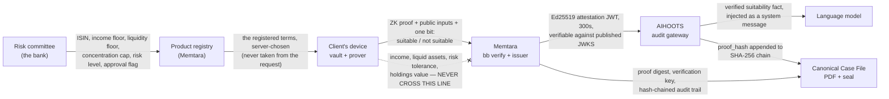

# Memtara — Landing Page Copy Deck

Target: `memtara.aihoots.com`, or a `/memtara` section on `aihoots.com`.

## How to use this document

This is copy, not design. Every heading, sentence and button label below is the
literal text to set; the layout, typography, grid and colour are yours. Nothing
here is a placeholder and nothing should be paraphrased "to make it flow" —
every factual claim on this page is traceable to a named file in this
repository (`README.md`, `scripts/demo_cro_workflow.py`,
`docs/REGULATORY_MATRIX.md`, `clients/prover/README.md`,
`tests/test_wealth_suitability_e2e.py`), and the audience is a bank technology
lead who will be asked to check it. If a claim needs to change, change the
repository first. Where a number appears, it is a measured number, not a
rounded-up one.

---

## 1. Hero section

**Recommended headline**

> Prove suitability. Audit every recommendation. Comply with DFSA COB 3.4.

**Alternate headline A**

> The client's device proves she qualifies. Your bank never sees the figures.

**Alternate headline B**

> Evidence a regulator can re-verify in 2031, from a key we published today.

**Subhead**

> Memtara is a structured-product suitability platform for UAE banks. A client's
> own device proves — against terms your risk committee registered in advance —
> that income, liquid assets, risk tolerance and portfolio concentration each
> clear the product's thresholds. The bank receives one bit and a proof.
> Real Zero-Knowledge Proofs (Baby Jubjub/Poseidon) — Not just a whitepaper.

**CTA buttons**

- Primary: `Run the demo — one command`
- Secondary: `Book a 30-minute technical call`

**Proof strip (one line, directly under the buttons)**

> 87/87 Rust tests, 61/61 Noir tests, 134/134 Python tests green · real
> `nargo execute`, `bb prove`, `bb verify` · one command, about 40 seconds,
> exit 0 · piloted by 0 banks, and we say so on this page.

---

## 2. The problem

**Section heading:** The file that gets assembled afterwards

An advisor recommends a five-year principal-protected note to a private client.
The conversation happens in a meeting room, on a call, or increasingly inside a
chat window with a model in it. The recommendation is made, the ticket is
booked, and the suitability assessment — the thing the recommendation was
supposed to depend on — is written up later that week.

The file that results is a collection of screenshots, a spreadsheet of the
client's declared assets, a PDF of a portfolio statement, and a signed form.
Each part is genuine. None of it is bound to the moment of the recommendation.
Nothing in that file distinguishes an assessment that was made before the advice
from one that was reconstructed to match it, and nothing proves which thresholds
were in force at the time or who chose them.

Two years later the client complains, or the regulator asks. The advisor has
moved firms, the spreadsheet has been edited, the product's terms have been
amended twice, and the honest answer to "what did you check, against what bar,
before you recommended this?" is that nobody can now prove it. There is a second
version of this problem arriving faster than the first: a model asked to
recommend a product will do so from the prompt text alone. Prompt text is
attacker-controlled — and it is also advisor-controlled. If the client's income
and the product's risk level reach the model as words in a prompt, then whoever
wrote the prompt set the bar the recommendation was measured against, which is
the mis-selling pattern the suitability rule exists to prevent.

---

## 3. How it works

**Section heading:** Four steps, and the figures never move

**Step 1 — The bank registers the product and its terms.**
Your risk committee registers the instrument in the product registry: ISIN,
income floor, liquidity floor, concentration cap, risk level. Until the
committee marks it approved, an assessment against that product is refused
outright, not flagged.

**Step 2 — The client's device proves against those terms.**
The device holds the four figures in a local vault and generates a real
zero-knowledge proof that each limb clears the registered threshold. Generating
a proof requires the plaintext as a witness, so a server able to prove would be
a server holding plaintext. There is no server-side fallback, by construction.

**Step 3 — Memtara verifies and signs a short-lived attestation.**
The proof is verified with Barretenberg inside the server, the verdict is read
from public input 11 rather than inferred from an exit code, and an Ed25519 JWT
is issued with a 300-second lifetime. The signing key is published at
`/.well-known/jwks.json`, so the attestation is checkable by anyone, offline,
years later.

**Step 4 — AIHOOTS injects the verified fact and chains the proof hash.**
AIHOOTS validates the attestation locally, injects the verified suitability fact
into the model's context as a system message before the model sees the
conversation, and appends the proof hash to its own tamper-evident SHA-256
chain — with no synchronous call back to Memtara.



**Caption to set under the diagram**

> Every solid arrow is data that actually moves. The dashed arrow is the one
> that does not: the four figures stay in the vault on the device. The demo
> verifies this against the evidence pack's own bytes at the end of every run,
> rather than asserting it.

---

## 4. Feature grid

Eight to ten cards. Title in bold, one sentence below.

**Registry, not catalogue**
Suitability thresholds come from the product registry your risk committee
controls, and a request that supplies its own thresholds is rejected with a 400
rather than quietly ignored.

**Canonical Case File**
One command exports a sealed PDF of the whole assessment — terms, proof digest,
verification key, attestation and both audit chains — around 51 KB, with a
sidecar `.seal.json`.

**Real zero-knowledge proofs**
Baby Jubjub EdDSA signatures, Poseidon hashes and Merkle commitments, Noir
circuits, Barretenberg proving and verification: `nargo execute`, `bb prove`,
`bb verify`, not a simulation of them.

**A decline is evidence too**
`suitable` is a public output of the circuit rather than an assertion, so a
"not suitable" verdict produces the same signed, chained, re-verifiable
evidence as an approval.

**Tenant isolation you can test**
Every table is scoped by `org_id`, and `test_one_banks_registry_is_invisible_to_another`
fails the build if one bank can see another's product registry or evidence pack.

**The vkey divergence check**
`GET /health` compares the verification key this instance is running against the
one committed to the repository and returns 503 if they diverge — a failure with
no other symptom, and one that would make today's accepted proofs unverifiable
tomorrow.

**Device prover SDK**
`memtara-prove` ships as a CLI and an embeddable module, with a documented WASM
route (`noir_wasm` + `bb.js`) for consumer apps and an explicit rule that a phone
never holds an org API key.

**Metrics without a tenant label**
`/metrics` is standard Prometheus exposition and carries no tenant-identifying
label, enforced by a test rather than by a convention.

**AIHOOTS hash chain**
The AI audit gateway appends the proof hash to its own SHA-256 chain, correlated
to Memtara's evidence pack by `regulatory_audit_id`, and verified by AIHOOTS's
own verifier — not ours.

**Published JWKS**
Attestations are Ed25519 JWTs checkable against `/.well-known/jwks.json` by any
third party, offline, without a call back to us and without trusting the
deployment that issued them.

---

## 5. What we do not claim

**Section heading:** The limits, named by us first

A control you find yourself, after being told everything was covered, poisons
everything else you were told. So here are ours, in the same words we use
internally.

- **Rate limiting is not a security boundary.** It defaults to 10 proof
  submissions per minute per user and it is enforced per process, so two
  replicas permit twice the limit. It bounds expensive work; a true global limit
  belongs at the edge.
- **A proof token is not revocable inside its 300-second lifetime.** That is the
  price of offline validation. Revoke the disclosure request or the session
  instead.
- **The PDF seal is not a digital signature your viewer will validate.** It is a
  detached SHA-256 digest plus an optional Ed25519 signature, not PAdES — no
  reader shows a green tick. The strongest authenticity claim in the pack is the
  Memtara JWT, checkable against the published JWKS.
- **We do not measure algorithmic bias.** Memtara narrows the feature surface a
  model can discriminate on, but it does not test for disparate impact, and a
  threshold can itself correlate with a protected class. That obligation
  (CBUAE §3(a)) remains yours.
- **A hash chain proves internal consistency, not availability.** An operator can
  still delete a whole log. Append-only storage and off-box replication are the
  mitigations and neither is in this repository yet.
- **No SOC 2, no ISO 27001, no penetration test, no SLA track record, and no
  container image.** The platform runs from source today. An SLA can be offered
  contractually; it cannot yet be evidenced. Org self-registration is still
  unauthenticated, and bilingual Arabic disclosure is specified in
  `docs/journeys.md` rather than built.

---

## 6. Verify it yourself

**Section heading:** Do not take the page's word for it

**One command**

```bash
python3 scripts/demo_cro_workflow.py
```

It boots its own Memtara instance, registers a bank and a product under
governance, onboards a synthetic client, generates a real proof on her "device",
verifies it inside the real server, issues a signed attestation, drives AIHOOTS's
real audit chain, and exports a sealed PDF. About 40 seconds on a developer
laptop, and it exits 0. It cleans up its own database rows unless you pass
`--keep-data`.

**Then verify the artefact it produced**

```bash
./scripts/memtara-export verify cro_demo/Case_File_<timestamp>.pdf
```

Exit 0 on the genuine file. Flip one byte and it exits 1. That has been
demonstrated, and it is the check we would run in your position.

**The five paths a technology lead should open first**

| Path | Why |
|---|---|
| `tests/test_wealth_suitability_e2e.py` | The one place in the repository where no part of the cryptography is stood in for: real Baby Jubjub signatures, real Poseidon commitments, real `bb prove`, real `bb verify`. |
| `scripts/demo_cro_workflow.py` | The demo itself, including the module docstring that names on screen the one thing that is not real — the upstream language model, stubbed by AIHOOTS's own CI policy. |
| `docs/REGULATORY_MATRIX.md` | Clause-by-clause CBUAE mapping with the four genuine gaps stated on page one, plus the DFSA Conduct of Business suitability appendix. |
| `clients/prover/README.md` | The device prover, the two deployment shapes, and the reason a phone must never hold an org API key. |
| `docs/openapi.yaml` | The wire contract — 28 paths. |

**What you will see**

The console prints the client's four figures once, at onboarding, and then
prints them again at the end under `not held:` — after checking the evidence
pack's raw bytes to confirm none of them appear in it. Between those two points
a real proof was generated, verified, attested, injected into a model's context
and sealed into a PDF, and the bank ended up holding the verdict and none of the
inputs.

**A citation note we would rather you hear from us**

The tokens emit the string `COB 3.1`, because that is the identifier relying
parties were told to match. COB 3.1 is "Application"; the DFSA suitability
obligation is **COB 3.4**. It is a one-line change, it is the caller's decision
rather than ours, and it is documented in `docs/REGULATORY_MATRIX.md` rather
than fixed silently. A deployment filing evidence with the DFSA should use
COB 3.4.

---

## 7. The honest one

**Section heading:** Piloted by 0 banks? Yes. Ready for your bank? Absolutely.

No bank has piloted Memtara. There are no paying customers, no regulatory
approval, no DFSA or CBUAE endorsement and no sandbox admission, and you should
assume any vendor in this category who implies otherwise is describing a
conversation rather than a contract. What the first bank gets instead is the
thing that stops being available the moment there is a second: direct access to
the engineers who wrote the circuits, commercial terms set before there is a
reference customer to price against, and a roadmap that bends to one
institution's product governance rather than to the average of ten.

The parts that are usually taken on trust — the proofs, the tenant isolation, the
tamper detection, the case file — are checkable this afternoon by one of your
engineers, from source, without talking to us. That is the trade being offered:
no logos, everything verifiable.

**CTA under this section:** `Book a 30-minute technical call`

---

## 8. The CRO demo video script

Two minutes. Narration paced at roughly 150 words per minute. The ON SCREEN
column refers to the actual output of `scripts/demo_cro_workflow.py` — the step
headings are the script's own `ui.step(...)` titles and must not be restyled or
invented. Record the terminal at full width with colour on.

| TIMECODE | ON SCREEN | NARRATION |
|---|---|---|
| 0:00 | Static title card, then the demo's opening banner: `MEMTARA — STRUCTURED PRODUCT SUITABILITY, END TO END`, followed by its own three-line preamble ending "This demonstration produces the same evidence and holds none of them." | A DFSA-regulated firm must satisfy itself that a structured product is suitable before recommending it, and be able to show it did — at the moment it did, not two years later. |
| 0:15 | Terminal, command typed: `python3 scripts/demo_cro_workflow.py`. Then `[1] Checking prerequisites` with green ticks for `nargo`, `bb`, `cargo`, `compiled circuit`, `pg8000`, `AIHOOTS submodule`; then `[2] Building and starting Memtara`, `base url`, `health`, `published vkey  matches`. | One command starts everything. It builds the Rust server, boots it, and checks its own prerequisites first — nargo, Barretenberg, the compiled circuit. Health reports the published verification key as matching the one committed to the repository. |
| 0:30 | `[3] Registering the bank, and the product under governance`. Highlight `product`, `isin  XS2500000018 (check digit valid)`, the two `terms` lines, `risk committee  NOT YET APPROVED`, the dim note "an assessment against it is refused (…) until the committee signs off", then `risk committee  APPROVED (audited)`. | Step three registers the bank and the product. Income floor, liquidity floor, concentration cap, risk level. Before the risk committee approves, an assessment against that product is refused. Then the committee signs off, and the approval is audited. |
| 0:45 | `[4] Onboarding the client` — the four `ui.detail` lines for income, liquid assets, risk tolerance and existing holdings, then the note "these four figures live only in …/client_42_vault.json — nothing above is sent anywhere" and `vault root synced`. Then `[5] The advisor asks the AI to recommend the product` with the quoted prompt. | The client's four figures go into a vault file on her device and stay there. Only a Poseidon commitment is synced. The advisor then asks the model to recommend the note. The prompt names the product; it cannot set the product's terms. |
| 1:00 | `[6] The client's device generates a zero-knowledge proof` — the note "real nargo execute + bb prove", then `elapsed`, `request id`, `verdict  SUITABLE` and the note about public input 11. Then `[7] Memtara verifies the proof and issues a signed attestation` — `bb verify  accepted`, `verification key`, `proof sha-256`, `attestation`, and the JWKS note. | The device runs nargo execute and bb prove for real. Memtara verifies with bb verify, then reads the verdict from public input eleven rather than inferring it from an exit code, and issues an Ed25519 attestation anyone can check against the published JWKS. |
| 1:18 | `[8] The claim is injected into the model's context, and logged` — `injected as  system message, before the model sees the conversation`, the dimmed preamble lines, the green `✓ no client figure appears in the injected claim`, then `chain entry  seq …, record_hash …`, `linked by  proof_hash …`, and `✓ AIHOOTS audit-verify: chain intact`. | AIHOOTS validates that attestation locally and injects the verified fact as a system message before the model sees the conversation. The proof hash joins Memtara's evidence pack to AIHOOTS's own SHA-256 chain, and their verifier reports the chain intact. |
| 1:35 | `[9] Exporting the Canonical Case File` — `case file`, `size`, `pdf sha-256`, `evidence sha-256`, `seal  signed`, and both notes including "not a PAdES signature — no viewer will show a green tick". Cut to the PDF open on screen, then to a second terminal running `scripts/memtara-export verify` on the genuine file (exit 0) and on a byte-flipped copy (exit 1). | The Canonical Case File is written and sealed: a detached SHA-256 digest and signature, not a PAdES signature — no viewer shows a green tick. Re-check it with memtara-export verify. It exits zero on the genuine file and one on a byte-flipped copy. |
| 1:50 | `[10] What the bank now holds, and what it does not` — the four green ticks, then the four `not held:` lines with the client's figures, then the closing line `✅ CRO Demo Complete. Report saved to cro_demo/Case_File_<timestamp>.pdf.` / `Show this to any Head of Digital Wealth.` Hold, then a black card reading "Piloted by 0 banks? Yes. Ready for your bank? Absolutely." | The bank now holds the attestation, the terms, the proof and the chain — and not the income, the liquid assets, the risk tolerance or the holdings. The demo signs off: show this to any Head of Digital Wealth. Piloted by zero banks. Ready for yours. |

**Narration word count: 316 words.** At 150 words per minute that is
approximately 2 minutes 6 seconds of speech across a 2-minute window, which
leaves the gaps between rows for the terminal to be read rather than talked
over. If the edit runs long, cut the second sentence of the 0:30 row (12 words)
before cutting anything else — the risk-committee refusal is the only place a
CRO sees governance enforced, so cut it last.

---

## 9. SEO and metadata

**Page title (60 characters or under)**

> Memtara — Zero-Knowledge Suitability for UAE Banks

**Meta description (144 characters)**

> Prove structured-product suitability with real zero-knowledge proofs. The
> client's device proves; your bank holds the evidence, not the figures.

**Open Graph title**

> Prove suitability. Audit every recommendation. Comply with DFSA COB 3.4.

**Open Graph description**

> Real ZK proofs (Baby Jubjub/Poseidon), a Canonical Case File a regulator can
> re-verify from a published key, and one command that shows the whole thing.

**Target search phrases**

1. DFSA COB 3.4 suitability evidence
2. structured product suitability assessment UAE bank
3. zero knowledge proof KYC / suitability DIFC
4. AI advice audit trail CBUAE guidance note

**H1 on the page:** the recommended hero headline, verbatim.
**Canonical:** `https://memtara.aihoots.com/`
**No claim in any meta field may name a bank, regulator or customer.**
