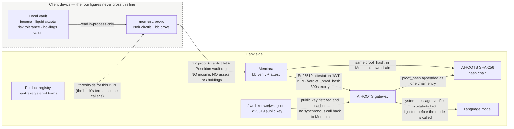
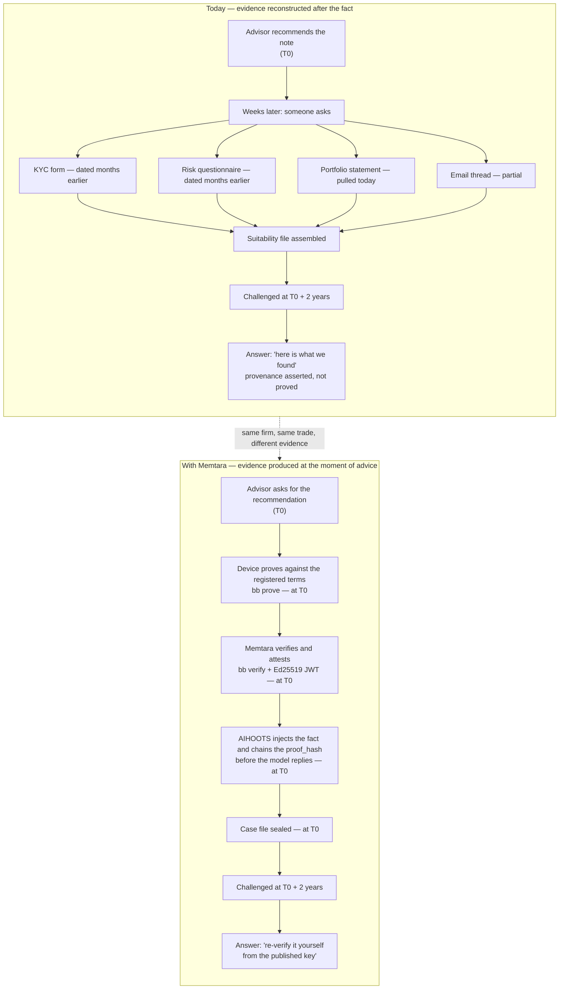

# LinkedIn series — five posts

Written in first person, as the founder. Paste-ready.

**Before you post, read this.** LinkedIn truncates at the "see more" fold at
roughly 200 characters on mobile. The first two lines are the entire post as
far as most of the feed is concerned — everything after them is opt-in. So each
post below opens with its hook as the first two lines, and nothing above them.
Do not add a greeting, a preamble or a "long post, bear with me" line; it will
eat the fold.

Other conventions used throughout:

- 150–250 words per post. Short paragraphs, one idea per line break.
- At most one emoji per post, and only where it does real work. As drafted,
  none of the five use one — that is deliberate, not an oversight.
- No engagement bait. No "comment YES below", no polls-as-reach-hacks.
- No exclamation marks.
- Anything in `[SQUARE BRACKETS]` is a placeholder you must fill in before
  posting. There is one, in Post 5.
- Dates below assume a Tue/Wed/Thu cadence over three weeks starting the week
  of 17 August 2026. Shift the whole block if you need to; keep the ordering
  and the roughly-two-day gaps.

---

## Post 1 — The mis-selling problem in UAE wealth

**Publish:** Tuesday 18 August 2026

**Hook (first two lines):**
> The suitability file is usually assembled after the recommendation.
> That ordering is the whole problem.

**Copy:**

The suitability file is usually assembled after the recommendation.

That ordering is the whole problem.

An advisor recommends a structured note on a Tuesday. Some weeks later — often
because someone has asked — a file comes together. A KYC form. A risk
questionnaire dated months earlier. A portfolio statement pulled on the day of
assembly. An email thread.

Every document in it is real. The file still cannot answer the question that
matters.

It cannot show what was checked at the moment of recommendation. It cannot show
which version of the product's terms the check ran against. And where the
thresholds are supplied by whoever is making the recommendation, the check is
circular: the person being measured is also setting the bar.

DFSA COB 3.4 asks a firm to have a reasonable basis for the recommendation.
"Basis" describes a state that exists before the advice, not a folder produced
after it.

I am not going to quote you a mis-selling statistic. The numbers in circulation
are not sourced well enough to survive a risk officer reading them properly,
and the mechanism is enough on its own.

If the evidence is reconstructed, then in a dispute two years later you are
asking a regulator to prefer your reconstruction to the client's.

That is a weak position to be in, and it is avoidable.

**Hashtags:** #WealthManagement #DIFC #Suitability #RegTech #StructuredProducts

**Graphic:** A single two-column timeline, one row per artefact. Left column
"When it was created", right column "When it was collected", with a vertical
red line marking the moment of recommendation. Every artefact sits to the left
or right of that line, and the point lands visually: nothing was created *at*
the line. Muted palette, no stock photography, no advisor-shaking-hands image.

**What a good response looks like:** Comments or DMs from compliance and risk
people describing their own assembly process — especially anyone who says "we
do it monthly" or "we pull it when the file is requested". Likes from other
founders are noise.

---

## Post 2 — Why AI hallucinations break suitability

**Publish:** Thursday 20 August 2026

**Hook (first two lines):**
> Ask a language model to recommend a structured product and it will.
> It has no way to know whether the client qualifies.

**Copy:**

Ask a language model to recommend a structured product and it will.

It has no way to know whether the client qualifies. It only has the prompt.

Inside a context window there is no difference between a fact and an assertion.
"Client 42 is high net worth, risk tolerance 5" is text. The model treats it as
true because everything in the window is treated as true. That is not a defect
you can train out; it is what a context window is.

That text is attacker-controlled in the strict sense — anyone who can write
into the context can set it. More often it is something duller and just as
damaging: stale, copied from a CRM, or typed optimistically by someone in a
hurry.

The usual answer is a better system prompt. Tell the model to be careful. Add a
guardrail that asks it to refuse if it is unsure.

This does not work, and not for engineering reasons. You are asking a model to
distrust its own input using more of its own input.

The fix has to arrive from outside the model. The eligibility fact must be
produced by something that actually verified it, carried in a form the model
cannot forge, and injected before the model sees the conversation.

Then the model can still write bad prose. It cannot invent the verdict, because
the verdict was never its to generate.

**Hashtags:** #AIGovernance #RiskManagement #LLM #FinancialServices #DIFC

**Graphic:** Two context windows side by side, rendered as literal text blocks.
Left: an advisor prompt with the claim "risk tolerance 5" highlighted, labelled
"asserted — anyone who can type can set this". Right: the same conversation with
a system message above it carrying a verified claim and a proof hash, labelled
"attested — validated against a published key before the model was called".
Monospace, no icons.

**What a good response looks like:** Engineers and AI-governance people arguing
about the mechanism in the comments. If the thread turns into "which model do
you use", the hook was too generic.

---

## Post 3 — Introducing Memtara and AIHOOTS

**Publish:** Wednesday 26 August 2026

**Hook (first two lines):**
> Two products, one job, and a deliberate line drawn between them.
> Here is what each one does, and what it refuses to do.

**Copy:**

Two products, one job, and a deliberate line drawn between them.

Here is what each does, and what it refuses to do.

Memtara is a structured-product suitability platform. The client's own device
proves — against the terms the bank registered in advance — that income, liquid
assets, risk tolerance and portfolio concentration each clear that instrument's
thresholds. The device sends a proof and one bit: suitable, or not suitable.
The bank never receives the figures.

Named precisely, because this is the part people check. Baby Jubjub EdDSA
signatures over the client's attributes. Poseidon hashes and Merkle commitments.
Circuits written in Noir. Proving and verification with Barretenberg. An Ed25519
attestation JWT whose public key is published at /.well-known/jwks.json.

AIHOOTS is a separate product: an AI audit gateway. It validates Memtara's
attestation locally against that published key — with no synchronous call back
to us — injects the verified fact into the model's context, and appends the
proof hash to its own SHA-256 chain.

Memtara proves and attests. AIHOOTS injects and chains. The proof hash is the
join key between the two logs.

Where we are: cargo test 87/87, nargo test 61/61, Python 134/134.

Piloted by 0 banks? Yes. Ready for your bank? Absolutely — and the way to
settle that is to run it yourself rather than take my word for it.

**Hashtags:** #ZeroKnowledgeProofs #RegTech #PrivateBanking #ADGM #AIGovernance

**Graphic:** The architecture Mermaid diagram below (Graphics → Diagram 1),
exported as a clean PNG. Keep the arrow labels legible at feed size; if they
are not, split it into two slides in a document post rather than shrinking the
type.

**What a good response looks like:** Someone naming a specific component back
at you — Noir, Barretenberg, Poseidon — or asking where the verification key
lives. That is a technical reader self-identifying, and it is the highest-value
reply this post can get.

---

## Post 4 — The CRO demo: forty seconds to a cryptographic case file

**Publish:** Tuesday 1 September 2026

**Hook (first two lines):**
> One command, about forty seconds on a laptop.
> What falls out is a sealed case file that still re-verifies years later.

**Copy:**

One command, about forty seconds on a laptop.

What falls out is a sealed case file that still re-verifies years later.

python3 scripts/demo_cro_workflow.py

It boots its own Memtara instance. Registers a bank, then a product under
governance — and refuses to assess anyone against that product until the risk
committee has approved it. Onboards a synthetic client whose four figures are
written to a local vault file and go nowhere else.

An advisor asks the model to recommend the note. The client's device generates
a real zero-knowledge proof: nargo execute, then bb prove. The server verifies
it with bb verify and issues a signed attestation.

The verdict is read from public input 11 of the circuit, not inferred from bb
verify exiting 0. A proof of "not suitable" verifies exactly as cleanly, and a
system that reads the exit code approves everyone who was assessed.

AIHOOTS injects the verified claim and appends the proof hash to its chain. The
run exports a case file of about 51 KB with a .seal.json sidecar.

Then the part worth watching. The verifier exits 0 on the genuine file and 1 on
a copy with a single byte flipped.

What it is not: a PAdES signature. No PDF reader will show you a green tick.
The authenticity claim is the JWT, checkable against the published JWKS.

**Hashtags:** #RegTech #Compliance #ZeroKnowledgeProofs #WealthManagement #DFSA

**Graphic:** Terminal screenshot (Graphics → Static 1). Ideally paired as a
two-slide document post: slide one the successful run, slide two the two-line
verifier output — exit 0 on the genuine file, exit 1 on the byte-flipped copy —
side by side.

**What a good response looks like:** Someone runs it and says so, or asks a
sharp question about the stubbed upstream model. Treat any "can I see this on a
call" as the real signal and move it off-platform the same day.

---

## Post 5 — We are looking for two pilot banks

**Publish:** Thursday 3 September 2026

**Hook (first two lines):**
> We are looking for two pilot banks.
> To be exact about where we stand: we have zero today.

**Copy:**

We are looking for two pilot banks.

To be exact about where we stand: we have zero today, no regulatory approval
and no sandbox place.

What a pilot is. One instrument from your registry, its real suitability terms,
and synthetic clients. No client data crosses into the pilot. We run Memtara
from source alongside your environment — there is no container image yet —
register the product, generate proofs, and produce sealed case files your risk
function can take apart.

What you get. Case files a third party can re-verify from a published key. Our
regulatory matrix, which names four genuine gaps on its first page. And a
written list of known limits: rate limiting is per process, a proof token is not
revocable inside its 300-second life, and we do not measure disparate impact.
You will get those from me faster than from your own team, which is the point.

What we need. About an hour from someone in risk or compliance. About an hour
from architecture. One instrument's terms. And a named person who can say yes
or no at the end.

The ask is a 15-minute call. Not a workshop, not an RFI, not a discovery
programme.

If you are a CRO, Head of Compliance or Head of Digital Wealth at a DIFC or
ADGM firm, message me here or email [YOUR EMAIL ADDRESS].

**Hashtags:** #DIFC #ADGM #PrivateBanking #RegTech #Fintech

**Graphic:** The single-stat card (Graphics → Static 3). Restraint matters more
here than on the other four — this post is the ask, and a busy graphic reads as
a pitch deck. A plain card with the stat and the URL of the repository is
enough.

**What a good response looks like:** Two to five DMs that name an institution
and a role. One booked 15-minute call is a successful post; public comments
without a booked call are not.

---

# Graphics

## Diagram 1 — Where the data goes, and where it does not

Every arrow is labelled with what actually crosses it. The dashed box is the
boundary the client's four figures never leave.

Two things the diagram has to make unmissable, so check them in the export:
the labelled arrow leaving the device says what is absent as well as what is
present, and the terms arrow points *into* the device from the registry — the
caller never supplies its own thresholds.

## Diagram 2 — How suitability evidence is assembled, before and after

A before/after over the same spine. Both halves share the recommendation event
and the challenge event; only what happens between them changes.

The contrast to preserve if you redraw this: on the left, every arrow into the
file happens *after* T0. On the right, everything happens *at* T0 and the last
step hands the checking to the other party rather than performing it for them.

## Static graphic specs

### Static 1 — Terminal screenshot of the demo

**Must show:** the command `python3 scripts/demo_cro_workflow.py` at the top;
the numbered step headings the script actually prints, including "The client's
device generates a zero-knowledge proof" and "Memtara verifies the proof and
issues a signed attestation"; the elapsed-time line; the verdict line reading
SUITABLE; and the closing "What the bank now holds, and what it does not" block
with the four `not held` lines visible. Retina capture, dark terminal, 14pt+
monospace so the arrow labels survive LinkedIn's compression.

**Must not accidentally reveal:** your shell prompt. Rename the host and user
before capturing, and check the scrollback above the command for a pasted API
key, a `DATABASE_URL` with a real password, or an `export MEMTARA_PRIVATE_KEY`
line. Crop the window chrome rather than trusting it to be empty.

### Static 2 — Crop of the Canonical Case File's seal page

**Must show:** the SHA-256 digest of the PDF and the canonical evidence digest,
the verification-key digest, the `kid` of the issuing Ed25519 key, and the
line stating that the pack is tamper-evident. Include the sentence that says
this is a detached digest and not a PAdES signature — that caveat is a selling
point with this audience, not a blemish, and cropping it out turns an honest
artefact into an overclaim.

**Must not accidentally reveal:** a real ISIN belonging to an instrument you do
not control. Use `XS2500000018`, the structurally valid demo identifier from the
repo, and confirm no other instrument reference appears in the crop. Also check
for the synthetic client's label if you have edited the demo's fixture to
anything resembling a real name.

### Static 3 — Single-stat card

**Must show:** one statistic and nothing else. Recommended:
**"Four figures assessed. One bit disclosed."** with a one-line subhead reading
"Income, liquid assets, risk tolerance, concentration — none of them reach the
bank." Alternatives that are equally defensible: "40 seconds, one command, one
sealed case file", or "Piloted by 0 banks." Put the repository URL in small
type at the bottom so the card is actionable. Flat background, one typeface,
no gradient, no icon.

**Must not accidentally reveal:** a number we cannot source. Do not put a fine
figure, a mis-selling rate, a market-size estimate or a customer count on this
card — a single unsourced statistic on an otherwise checkable card is the fastest
way to lose the reader who was about to clone the repo.
